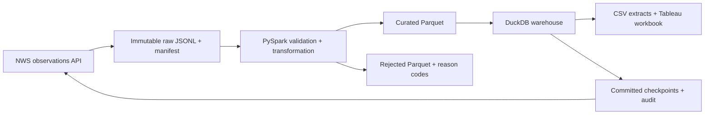

# Weather Data Pipeline

A working data engineering project that collects real National Weather Service observations for Austin (KAUS), Chicago (KORD), and New York (KJFK), cleans them with PySpark, and loads a local DuckDB analytical warehouse. It includes a tested hourly Docker worker, operational health checks, verified backup/restore, and warehouse-to-dashboard reconciliation.

The project asks three questions: how do recorded temperatures vary by station and time, how many observations are available, and how complete are their temperature, humidity, and wind measurements?

For a presentation or review, start with the [five-minute walkthrough](docs/project-walkthrough.md), [phase status](docs/phase-status.md), and [offline demo](docs/demo.md). Release 0.2.1 includes the native Tableau compatibility correction, a recorded-data demonstration, and portable packaging alongside the live pipeline. The corrected dashboard was opened and verified in Tableau Desktop 2026.2.2.

## Architecture



Raw observations stay available for replay. Spark performs the actual type checks, unit conversion, validation, and deterministic deduplication. Warehouse facts, audit records, and incremental checkpoints commit together. The local warehouse requires no cloud account or API key.

## Quick start

Use Python 3.11–3.13 and Java 17 or 21 on macOS or Linux. Python 3.12 and Java 21 were used locally. A project-local `.venv` and `.runtime/java21` are already prepared in this workspace; they are intentionally excluded from Git. Windows users can use the container route, because local process locking uses POSIX `fcntl`.

```bash
python3.12 -m venv .venv
source .venv/bin/activate
python -m pip install -e '.[dev]'
weather-pipeline run --hours 24
weather-pipeline status
weather-pipeline dashboard
```

If using the environment already installed here:

```bash
.venv/bin/weather-pipeline run
.venv/bin/weather-pipeline status
.venv/bin/weather-pipeline dashboard
```

The first run loads the preceding 24 hours. Later runs start at each station's committed checkpoint minus a two-hour overlap. `--hours` applies only to stations with no checkpoint. Change station IDs, initial history, and overlap in `settings.toml`. Set `JAVA_HOME` to a compatible runtime if one is not detected. Optionally set `NWS_USER_AGENT` to your project name and contact information.

## Operating the pipeline

```bash
# Replay exactly the saved API input; no network call.
weather-pipeline replay data/raw/<batch-id>/manifest.json

# Regenerate BI datasets from the warehouse.
weather-pipeline export

# Build a native Tableau workbook (format 18.1, verified in Desktop 2026.2.2).
weather-pipeline dashboard

# Verify that the packaged dashboard still matches the warehouse.
weather-pipeline audit-dashboard

# Demonstrate validation, replay and recovery offline in a new directory.
weather-pipeline demo --output-dir artifacts/demo

# Check station freshness, live processing, and unresolved failures.
weather-pipeline health --output data/health.json

# Create a verified backup, then restore its returned ZIP to a new directory.
weather-pipeline backup --output-dir backups
weather-pipeline restore backups/<backup-name>.zip --destination data-restored

# Run hourly in the foreground; stop with Ctrl+C.
weather-pipeline schedule --interval-minutes 60 --with-dashboard

# Run one scheduled iteration, returning a nonzero code if it fails.
weather-pipeline schedule --max-runs 1

# Backfill a specific recent UTC window without advancing live checkpoints.
weather-pipeline run --start <recent-start-ISO-with-timezone> --end <recent-end-ISO-with-timezone>

# Keep an experiment isolated from the default warehouse.
weather-pipeline --data-dir data-experiment run --hours 6
```

The source is a recent-observation API, not a historical archive. This client limits requested history to seven days (with a one-minute boundary grace); this is a conservative client policy, not a source completeness guarantee. Observations can be delayed or absent. Replay uses locally retained input and is not limited by the API's recent-history window.

Two hours of overlap can catch many late arrivals and corrections, but cannot guarantee capture of revisions older than the overlap. Increase it within the supported source window or run an explicit recent backfill. A checkpoint older than the API history limit produces an actionable failure instead of silently claiming an empty catch-up succeeded.

## Outputs

| Location | Contents |
|---|---|
| `data/raw/<batch-id>/` | Raw observation envelopes, original feature JSON, and an immutable manifest |
| `data/processed/<batch-id>/<attempt-id>/curated/` | Valid, deduplicated Parquet observations |
| `data/processed/<batch-id>/<attempt-id>/rejected/` | Invalid input with its original JSON and rejection reasons |
| `data/reports/<batch-id>.json` | Quality counts and station coverage signals |
| `data/reports/<batch-id>/<attempt-id>.json` | Per-attempt quality reports, including rejected replays |
| `data/warehouse.duckdb` | Facts, dimensions, version ledger, run audits, and checkpoints |
| `data/exports/` | Observation, daily summary, and run-quality CSV files |
| `data/tableau/weather_observatory.twbx` | Portable Tableau workbook with three sheets and embedded CSV snapshots |
| `data/tableau/audit.json` and `audit.md` | Current dashboard data and structure reconciliation |
| `data/events.jsonl` | Successful and failed operation events |
| `data/scheduler.json` | Worker phase, last result, and next scheduled run |
| `backups/` | Verified, timestamped ZIP snapshots created on demand |
| `artifacts/demo/report.md` | Recorded-data demonstration and its validation evidence |
| `artifacts/release/` | Distributable Python wheel and checksummed source ZIP |

See [the data model](docs/data-model.md), [quality rules](docs/data-quality.md), and [recovery procedures](docs/runbook.md). Operations are covered in [deployment](docs/deployment.md), [monitoring](docs/monitoring.md), and [backup/restore](docs/backup-restore.md). Dashboard files and usage are documented in [dashboard/README.md](dashboard/README.md), with [data reconciliation and visual verification](docs/dashboard-validation.md).

## Validation

```bash
python -m pytest -q
python -m ruff check src tests scripts
```

Tests cover API retry/pagination failures, bad records, deterministic deduplication, measurement units, incremental windows, immutable-batch replay, warehouse transaction rollback, newer corrections, stale replay, checkpoint behavior, and dashboard structure. Spark tests require permission to bind a local loopback socket. Network tests are mocked; the live-data run is recorded separately in `docs/verification.md`.

`requirements.lock` pins the full tested Python environment, including development tools. To reproduce it, install that file before installing this package with `pip install --no-deps -e .`.

The supplied [GitHub Actions workflow](.github/workflows/ci.yml) runs on pushes, pull requests, and manual dispatches. It tests the project, builds the wheel, and executes the packaged demo from a separate environment. See [CI and release validation](docs/ci.md).

## Portable release

```bash
python -m pip wheel --no-deps --wheel-dir artifacts/release/0.2.1 .
python scripts/check_release.py artifacts/release/0.2.1/weather_data_pipeline-0.2.1-py3-none-any.whl
python scripts/build_source_release.py --output-dir artifacts/release/0.2.1
```

The verified files and their acceptance report are in `artifacts/release/0.2.1/`.
The wheel includes the Python application and recorded public NWS sample. The source ZIP additionally includes tests, diagrams, operating instructions and the CI workflow, with per-file checksums in `RELEASE-MANIFEST.json`. Live warehouse data, local runtimes, backups and Git metadata are excluded. Both artifacts can be used without access to this workspace; Python dependencies and a compatible Java runtime are still required.

The demo uses an isolated, absent or empty destination. It never writes to the live warehouse. Recorded weather observations remain real; deliberately malformed inputs are labeled validation probes and rejected. Repeating the demo requires a new output directory because existing results are preserved.

## Container option

```bash
sh scripts/compose.sh build
sh scripts/compose.sh up -d
sh scripts/compose.sh ps
sh scripts/compose.sh logs -f
sh scripts/compose.sh stop
```

The service performs hourly runs with automatic Tableau refresh and audit, and persists data in `./data`. The wrapper mounts the data directory at the same absolute path inside and outside Docker so archived manifests remain usable in both environments. It accepts `WEATHER_DATA_DIR` for a separate deployment; relative overrides resolve against the project directory. The image and a live scheduled cycle have been tested. A local hourly worker was started during the operational build; use `ps` to inspect its current state and `stop` to pause it.

The worker has a two-CPU/two-GiB limit and bounded container logs. Health checks run every minute. Docker must be running, and laptop sleep can interrupt execution. Run only one scheduler for a data directory; stop the container before switching to a host scheduler or relocating data. Backups can run between cycles while the warehouse writer is idle.

## Scope and tradeoffs

- DuckDB is the local analytical warehouse. This implementation targets one writer and a portfolio-sized workload; it is not a deployed, distributed warehouse service.
- Spark uses two local workers and retains typed Parquet outputs. Most transformations can move to a cluster; filesystem paths, orchestration, and the warehouse loader would require adaptation.
- The dashboard reads exported snapshots. The Docker worker rebuilds and audits its package after each load. Reopen the regenerated workbook to see new data; an already opened package does not follow file changes, and no cloud BI refresh is configured.
- Temperature averages are observation-weighted sample averages, not time-weighted climatological averages. Stations may report at different or irregular frequencies.
- Measurement completeness measures available fields among received, accepted observations. Coverage warnings identify gaps or stale stations; the pipeline cannot prove how many source events were never published.
- MongoDB and Cassandra are optional and have not been added: there is no current access pattern that requires a second database.
- Health signals are available through the CLI and Docker. No email, chat notifications, or external monitoring service is configured. Backup and restore are on-demand operations with no automatic retention deletion.

## References

- [NWS API documentation](https://www.weather.gov/documentation/services-web-api)
- [PySpark installation](https://spark.apache.org/docs/4.0.1/api/python/getting_started/install.html)
- [DuckDB SQL documentation](https://duckdb.org/docs/stable/sql/introduction)
- [Retry-safe task principles](https://airflow.apache.org/docs/apache-airflow/stable/best-practices.html)
- [Star schema modeling](https://learn.microsoft.com/en-us/power-bi/guidance/star-schema)
