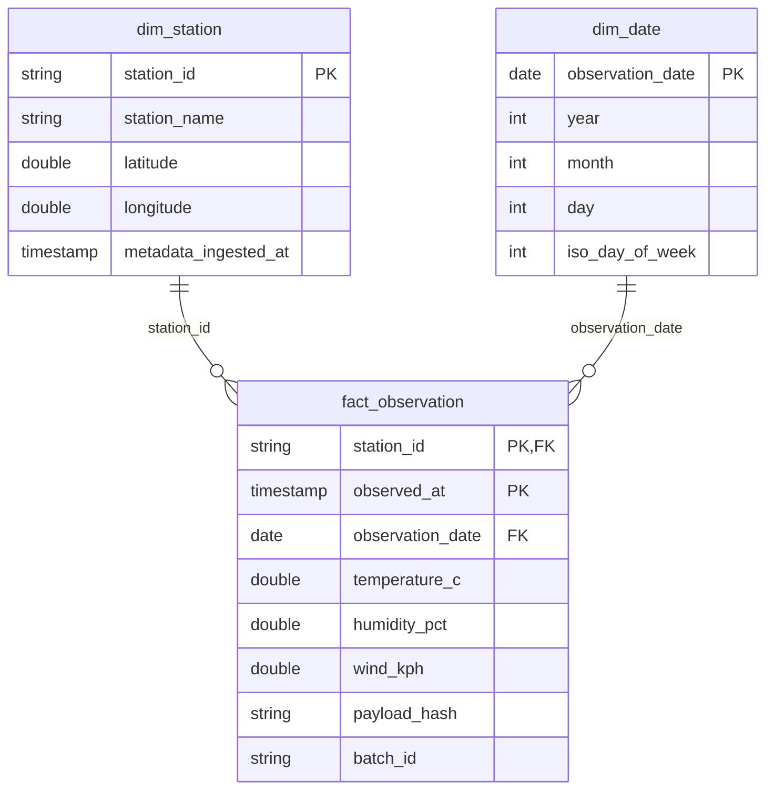

# Warehouse data model

All timestamps represent UTC. DuckDB stores them as `TIMESTAMP` without a zone after explicit normalization. API request windows are half-open: `[start, end)`. The observation date is the UTC date, not the station's local date.

## Facts and dimensions

| Table | Grain and key | Update policy |
|---|---|---|
| `fact_observation` | One NWS station at one observation timestamp; composite key `(station_id, observed_at)` | Insert new keys; update changed payloads only when the input version is at least as recent as the latest seen version |
| `dim_station` | One station; `station_id` natural primary key | Type 1: newer station metadata replaces older values; station history is not tracked |
| `dim_date` | One UTC date; `observation_date` primary key | Insert dates as observations arrive |
| `observation_versions` | One station/timestamp | Latest seen ingestion timestamp and hash, including sightings that did not change the business fact |
| `etl_runs` | One successfully committed raw batch; `batch_id` primary key | Append once; exact replay adds no audit row |
| `source_checkpoints` | One station; `station_id` primary key | Advance monotonically to the successfully fetched window end, in the load transaction |

An observation fact also has optional `text_description`, `latitude`, and `longitude`; required `source_ingested_at`, `batch_id`, and `loaded_at` retain lineage. `payload_hash` is SHA-256 of canonical raw feature JSON. A change in the raw feature counts as a correction even when selected dashboard measures remain equal.

## Measurement dictionary

| Field | Meaning | Null meaning |
|---|---|---|
| `temperature_c` | Air temperature in degrees Celsius | Source value unavailable |
| `humidity_pct` | Relative humidity as a percentage, 0–100 | Source value unavailable |
| `wind_kph` | Sustained wind speed in kilometers per hour | Source value unavailable; never interpreted as calm wind |
| `latitude`, `longitude` | Observation coordinates; dashboard falls back to station metadata | Coordinate unavailable |
| `source_ingested_at` | Time this raw batch was fetched | Never null |
| `loaded_at` | Time the current business fact was inserted/changed | Never null |
| `iso_day_of_week` | Monday=1 through Sunday=7 | Never null |

## Analytics views

`dashboard_observations` joins facts to station/date dimensions. Its grain remains one station/timestamp. `missing_measurement_count` is the number of null temperature/humidity/wind fields, from 0 to 3 per row.

`dashboard_daily` has one station/UTC-date row. It includes observation count; sample mean/min/max temperature; sample mean humidity/wind; field completeness; and latest observation timestamp. SQL averages ignore unavailable values. Do not average daily averages across days without weighting by the corresponding non-null measurement counts; calculate overall means from observation-level data.

`measurement_completeness_pct = 100 × (3 × observation_count − missing_measurement_count) / (3 × observation_count)`

`dashboard_quality` has one committed batch row, with received/accepted/rejected/duplicate counts and inserted/updated/unchanged warehouse counts. Batches can overlap: summing their accepted counts does **not** give the number of unique warehouse observations. Rejection percentage is null for an empty batch.

## Idempotency and correction ordering

Within a batch Spark chooses the greatest `source_ingested_at`, then greatest `payload_hash`, for each valid station/timestamp. Across batches the warehouse applies the same version ordering. The version ledger prevents an unchanged recent sighting from leaving an older version eligible to overwrite it later.

The NWS feature does not supply a reliable monotonically increasing revision number. Fetch time is therefore the proxy for revision order. An older archived fetch cannot overwrite a later fetch; this does not prove that a newly fetched source response itself contains the newest possible source revision.

A logical fingerprint covers manifest metadata, raw bytes, and sorted curated rows. Reusing a committed batch ID with different inputs fails. Parquet byte layouts can change on replay without changing logical results. Schema initialization is separate from data commits; all batch data, checkpoints, and success audit records share one transaction.
